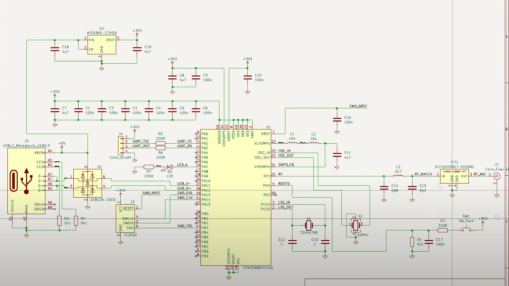
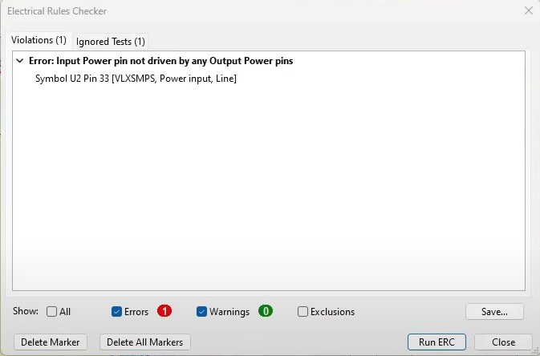

# STM32WB-Based USB, RF, and Power Hardware Design (KiCad 7)

## 1. Abstract
This project is a custom low-power wireless microcontroller board based on the STM32WB55 SoC, designed for IoT, automation, and wearable applications. The STM32WB55 integrates a dual-core processor (Cortex-M4 + Cortex-M0+) and a Bluetooth Low Energy 5.4 / IEEE 802.15.4 radio.  
The design prioritizes low power consumption, compact size, wireless connectivity, and ease of programming/debugging, while following industry-standard PCB design practices.

---

## 2. Objectives
- Create a compact, energy-efficient, wireless MCU platform.
- Implement full RF, power, and programming interfaces.
- Optimize for low-power operation in battery-powered scenarios.
- Ensure manufacturability and reliability using KiCad’s DRC/ERC checks.

---

## 3. Tools & Resources
- **KiCad 7** – schematic capture and PCB layout.
- **STM32WB55 Datasheet & Reference Manual** – for electrical specs, pin functions, and layout guidelines.
- **USB, RF, and power component datasheets** – for regulator, ESD protection, filters, etc.
- **KiCad ERC/DRC** – to detect design errors.

---

## 4. Block-by-Block Design

### a) Power Supply
- **USB-C Connector** – accepts 5 V input from a host or adapter.
- **MIC5365-3.3 LDO Regulator** – converts 5 V to a clean, stable 3.3 V supply.
- **Bulk Capacitors (4.7 µF)** – smooth voltage dips during load transients.
- **Decoupling Capacitors (100 nF)** – filter high-frequency noise close to MCU pins.  
**Why:** Stable, low-noise supply is critical for MCU and RF stability.

### b) SMPS Support
- Inductors & capacitor form the network for STM32WB55’s internal SMPS.  
**Why:** Improves efficiency and reduces average current draw in active mode.

### c) Clock System
- **32.768 kHz Crystal** – for RTC in low-power modes.
- **32 MHz Crystal** – for CPU and RF timing accuracy.  
**Why:** External crystals provide precise timing, enabling lower-power idle modes.

### d) RF Front End
- Matching network (L, C) – matches MCU RF pin to antenna impedance.
- Low-pass filter – removes harmonics for regulatory compliance.
- External antenna connector – improves range without increasing transmit power.

### e) Debug & Programming
- SWD header – connected to SWDIO, SWCLK, and NRST.  
**Why:** Enables firmware upload and real-time debugging.

### f) USB Interface
- USB-C data lines (D+, D–) – connected to MCU.
- ESD protection – prevents surge damage.
- Pull-down resistors (5.1 kΩ) – set device mode.

### g) UART Header
- TX, RX, GND, VCC pins – for serial debug/communication.
- Series resistors (100 Ω) – protect and improve signal integrity.

### h) Reset & Boot
- Push button – manual reset or boot mode trigger.
- Pull-up/pull-down resistors – define default logic states.

---

## 5. Low-Power Design Justification
- STM32WB55 supports Stop, Standby, and Shutdown modes with µA-level consumption.
- Internal SMPS provides up to 40% better efficiency than LDO alone.
- Low quiescent current LDO (29 µA) minimizes idle draw.
- Peripherals (USB, UART) powered only when needed.
- RF path impedance matched to operate at lower transmit power.

---

## 6. Datasheet Understanding
From the STM32WB55 datasheet, key design-relevant details were implemented:
- **Operating Voltage:** 1.71 V – 3.6 V
- **RF Frequency:** 2.400–2.4835 GHz
- **Output Power:** up to +6 dBm
- **RX Sensitivity:** -96 dBm (BLE 1 Mbps)
- **Low-Power Modes:** Stop mode @ 1.1 µA (RTC on), Shutdown @ 50 nA
- **SMPS Support:** external L, C network for higher efficiency
- **USB FS Support:** 12 Mbps
- **Recommended Crystals:** 32 MHz ±10 ppm, 32.768 kHz ±20 ppm
- **RF Matching Network:** 50 Ω impedance requirement for optimal performance

---

## 7. Circuit Schematic
The complete schematic of the STM32WB55 board is shown below:

  
*Figure 1 – Full STM32WB55-based USB, RF, and power hardware schematic.*

---

## 8. Common Design Challenges & Fixes
- **ERC Power Input Not Driven** → Added `PWR_FLAG` in KiCad.
- **Unconnected Pins** → Marked with “No Connect” or wired to GND.
- **Clearance Errors** → Adjusted trace width/spacing to meet manufacturer specs.

---

## 9. ERC Results
The KiCad Electrical Rules Checker (ERC) results for the schematic are shown below:

  
*Figure 2 – ERC output.*

---

## 10. Conclusion
This project delivered a low-power, wireless-ready STM32WB55 board with USB, SWD, UART, and optimized RF matching. It showcases:
- Component evaluation and selection from datasheets.
- PCB design best practices (decoupling, filtering, impedance matching).
- Low-power embedded system design for battery-driven IoT devices.

---

## 11. Relevance to Industry
The design process directly aligns with evaluation, qualification, and inspection roles:
- Reading and interpreting datasheets.
- Selecting components for electrical and mechanical compatibility.
- Ensuring layout meets signal integrity, EMC, and manufacturability standards.
- Applying low-power techniques relevant to modern embedded products.

---

## License
This project is licensed under the MIT License.
